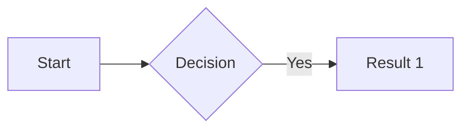

## Admonition 提示框

```

提示内容

```
或 Alert 语法：
```
> [!TIP]
> 提示内容
```

| 参数 | 说明 | 默认值 |
|------|------|--------|
| type | note/abstract/info/todo/tip/success/question/warning/failure/danger/bug/example/quote | note |
| title | 标题 | type 值 |
| open | 默认展开 | true |

## Image 增强图片

```

```

| 参数 | 说明 |
|------|------|
| src (1st) | 路径（必填） |
| alt (2nd) | 替代文本 |
| caption (3rd) | 图标题 |
| title | lightgallery 放大 |
| linked | 可点击 | true |
| loading | lazy |

## Tabs 标签页

```

{}内容1{}
{}内容2{}

```

| 参数 | 可选值 |
|------|--------|
| type | underline / pill / card / segment |
| placement | top / bottom / left / right |
| defaultTab | 0 ~ n-1 |

## Details 折叠内容

```

折叠内容

```

| 参数 | 说明 |
|------|------|
| summary (1st) | 标题 |
| open (2nd) | 默认展开 |
| name | 同组互斥 |

## Link 链接卡片

```

```

| 参数 | 说明 |
|------|------|
| href (1st) | URL（必填） |
| content (2nd) | 显示文本 |
| title (3rd) | 鼠标悬停提示 |
| card (4th) | 卡片样式 |
| card-icon (5th) | 图标 CSS class |

## Timeline 时间线

````markdown
```timeline {reverse=false animation=false placement=bottom}
events:
  - timestamp: 2024-07-11
    content: 创建成功
    type: primary
    color: "#0CBD87"
    size: large
    node: dot
```
````

## TypeIt 打字动画

```

打字内容

```

| 参数 | 说明 |
|------|------|
| code | 代码语言（语法高亮） |
| group | 同组顺序播放 |
| speed | 打字速度 ms | 100 |
| loop | 循环 |

```

public class Hello {}

```

## Bilibili 视频

```

     // 多P指定集数

```

## Douyin 抖音

```


```

## Bluesky

```

```

## Spotify

```


```

## GitHub Gist

```


```

## ECharts 图表

推荐用代码块语法：
````markdown
```echarts
{
  "title": { "text": "标题", "left": "center" },
  "xAxis": { "type": "category", "data": ["Mon","Tue","Wed"] },
  "yAxis": { "type": "value" },
  "series": [{ "data": [820, 932, 901], "type": "line" }]
}
```
````
或用 shortcode：
```

JSON / YAML / TOML 格式 option

```

## Mermaid 图表

推荐用代码块语法：
````markdown

````
或用 shortcode：
```

// mermaid code

```

Mermaid 类型：流程图 (graph)、时序图 (sequenceDiagram)、类图 (classDiagram)、状态图 (stateDiagram-v2)、ER 图 (erDiagram)、甘特图 (gantt)、用户旅程图 (journey)。

## FileTree 文件树

```

[files]
[files."src"]
[files."src/components".Header]
content = "Header.tsx"

```
支持 TOML / YAML / JSON 格式。

## APlayer 音频播放器

```

  

```

## Music 音乐播放器

```



```

server: netease / tencent / kugou / xiami / baidu
type: song / playlist / album / search / artist

## Mapbox 互动地图

```


```

需要 `hugo.toml` 中配置 `[params.mapbox] accessToken`。

## JSON 查看器

````markdown
```json {expandDepth=2, copyable=true, sort=false, boxed=true}
{ "key": "value" }
```
````

## FixIt Encryptor 内容加密

```

加密内容

```
